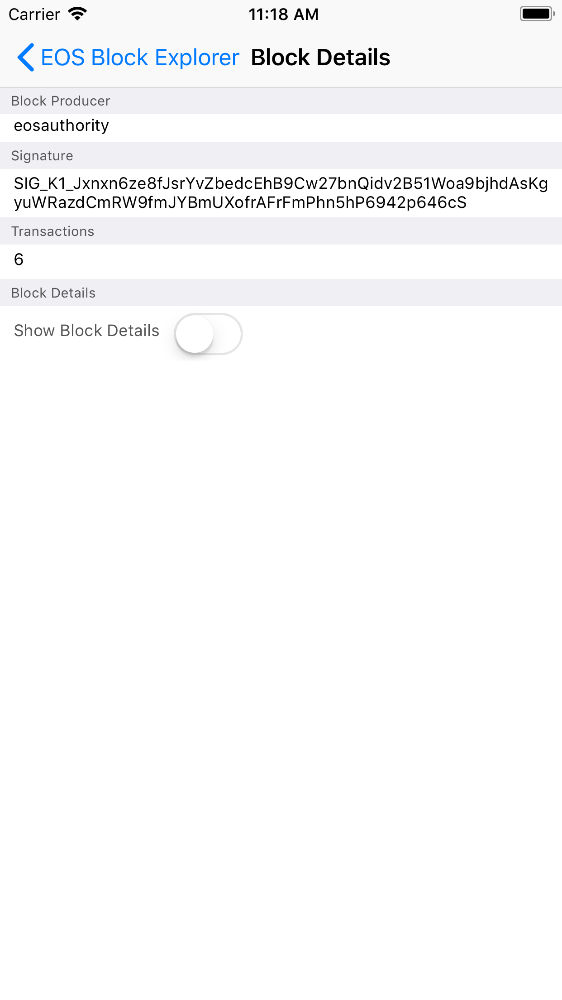

# EOS Block Explorer

App Preview
========


User Story:
========
```
As an EOS User I want to see the contents of the most recent blocks on the public
blockchain.

```
Resources:
========
● EOS: https://github.com/EOSIO/eos
● Public Node endpoint: https://api.eosnewyork.io/v1
○ Utilize RPC endpoints to get necessary data
● RPC Endpoint Documentation (block contents may vary):
https://developers.eos.io/eosio-nodeos/reference

Acceptance Criteria:
========
- [x] App has a button which when clicked will display a list of the 20 most recent blocks
- [x] When user clicks on a block they should be taken to a Block Details Screen.
- [x] The Details screen should show a summary view with of the block which contains the
producer, count of transactions and the producer signature.
- [x] The Details screen should have a toggle to show and hide the raw contents of the
transaction.
- [x] Application Code viewable Publicly on Github
- [x] Screenshots of working application should be in the github Readme
- [x] Application should be written in Swift4
- [x] Application should have unit tests

Bonus Criteria:
- [] Render the (markdown) ricardian contracts included in the abi with the relevant data
from the action. Example implementation in Javascript available here for reference:
https://codepen.io/chris-allnutt/pen/ERXwjb


Screenshots
========
<p align="center">




</p>


